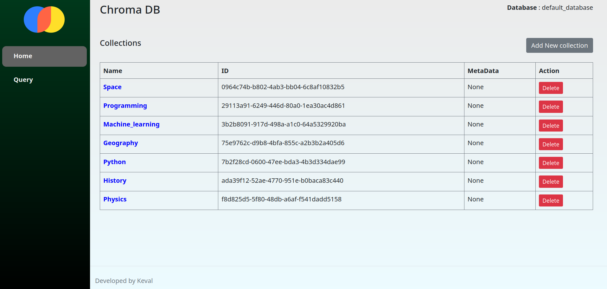
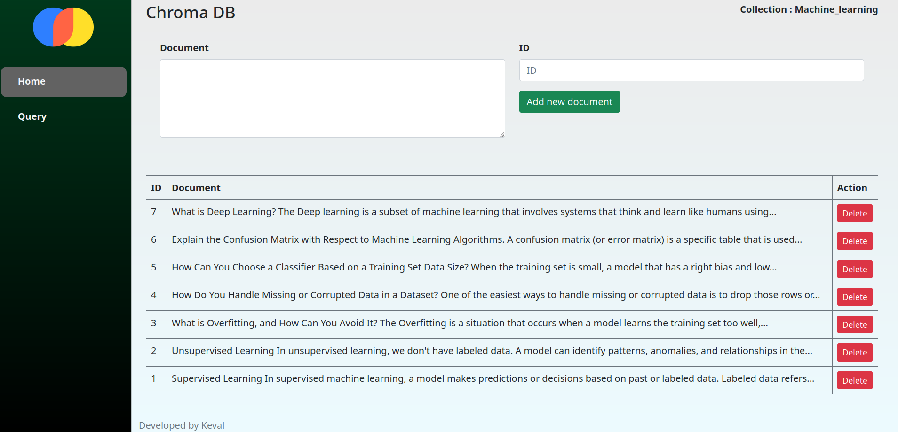
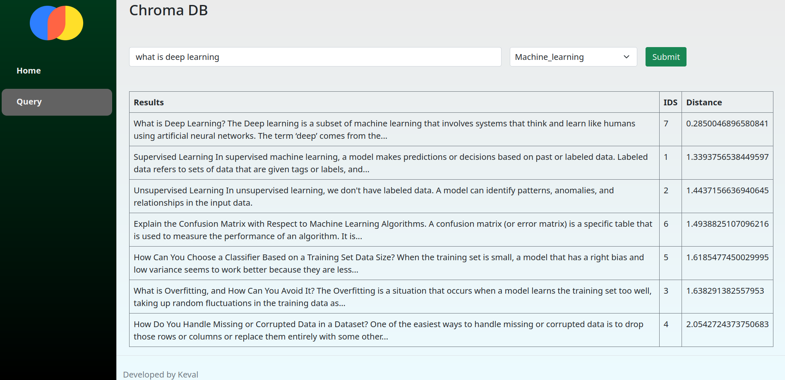

# ChromaDB UI

Chromadb frontend using python flask and Bootstrap.

## Installation

Clone github repository

```bash
git clone https://github.com/keval9098/chromadb-ui.git
cd chromadb-ui
```

Install required packages
```bash
pip install -r requirements.txt
```

Run flask server
```bash
python app.py
```

## Docker

Build docker image

```bash
docker build . -t ui:latest
```

Run docker image

```bash
docker run -d -p 8000:8000 ui:latest
```
Mount existing database

```bash
docker run -d -p 8000:8000 -v ./chroma_data:/code/chroma_data ui:latest
```

## Screenshots

### Homepage



### Collection



### Query

